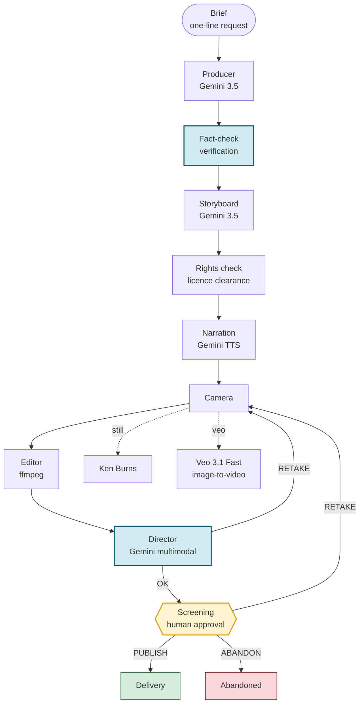

# Architecture

## The crew as a graph

## Why this shape

**The branches are total in code, not in the graph.** ADK marks both branch
nodes `NO DEFAULT`, and its graph cannot express a default here: a second edge
between the same pair of nodes is rejected as a duplicate. The routes are made
total where they are produced instead. The director's verdict comes out of an
`if/elif/else`, so it is only ever `OK` or `RETAKE`; the screening room maps
the human's answer with a total lookup, so anything it does not recognise
becomes `ABANDON` rather than a route with no edge. Routing a default to some
other node would have been worse than the warning — an unrecognised verdict
would quietly discard the film instead of reaching a person.

**A retake returns to the camera, and sits downstream of the join.** In an ADK
graph, running branches in parallel means a `JoinNode` waits on every upstream
output. If a retake only re-runs the camera, the join waits on a branch that
never runs again and **stalls without raising anything**. That's why the
parallel step (narration) sits outside the loop, before the camera, not
inside it.

**Narration sets the length, not the other way around.** A shot cut to the
storyboard's guess at reading speed ends while the line is still being read,
and the guess is wrong in a different direction for every language. So the
voice is recorded first and each shot is timed to the *measured* duration of
its audio. There is no words-per-second constant anywhere in the code.

**A critic only earns its keep with a different lens.** The director watches
video, not text, so it can't judge whether the narration itself is accurate.
The films state real numbers and history about real shrines and waterfalls,
so a wrong claim is the same kind of failure as a missing credit. Fact-check
cross-checks the script against the source data and blocks only **claims that
cause real harm if wrong** — numbers, proper nouns, official designations,
origin stories. It leaves tone and atmosphere alone; stopping those too would
thin the script out.

**The director remembers its own notes.** A critic that scores from zero
every time doesn't converge — measured, it oscillated at 68 → 62 → 68.
Handing it the previous notes and whether they were addressed makes it
converge instead (78 → 96).

**Every note the director issues has to be actionable.** It can only direct
within the levers the camera actually has — framing, distance, length,
exposure, contrast. A note the camera can't act on just spins the loop in
place.

**Nothing ships without a sign-off.** If a take still falls short of the bar
after the retake ceiling, it goes to screening anyway, marked
`accepted=false` with the director's objection attached. A person makes the
final call.

**The deliverable is the film, not where it lands.** The delivery node always
returns a download URL, the licence it inherited and the credit it owes.
YouTube is an additional destination when a channel is configured, not the
product itself. An earlier version reported `published: false` whenever no
channel was configured — that made a finished film look like a failure.
The screening gate exists because publishing is the one step in the whole
pipeline that can't be undone.

## Separation of responsibilities

| Layer | Contents | Depends on ADK |
|---|---|---|
| `retake/agent.py` | The graph definition — who runs, and when | Yes |
| `retake/nodes/` | The crew. Reads and writes graph state, decides routes | Yes |
| `retake/services/` | Pure functions for generation, rendering and rights checks | **No** |

Because `services/` knows nothing about ADK, rendering, generation and
rights logic can all be tested on their own even if the graph is broken.

## State and failure handling

- **Sessions** persist to Cloud SQL (Postgres). ADK keeps sessions in memory
  by default on Cloud Run, so a restart would **wipe a reel sitting at the
  screening gate** — the one place the run is deliberately paused, so it's
  the one place that can't be allowed to drop. Verified by swapping revisions
  and confirming state reads back (independent of `min-instances`). ADK uses
  `create_async_engine`, so the driver has to be an async one (`asyncpg`).
- **Assets**: the master lands in GCS; only the screening proxy (1/34th the
  size) rides along in the session. Cloud Run's filesystem is tmpfs, and
  loading the master into it would bloat the session. Delivery streams the
  file back — setting `Content-Length` turns it into a buffered response, and
  Cloud Run rejects anything over 32MB (the app returns 200 while the
  frontend sees a 500).
- **State serialization**: sessions persist as JSON, which turns integer
  keys into strings, so anything indexed is kept as a list instead of a dict.
- **Partial failure**: one location failing to shoot only drops that cut, not
  the whole shoot. A narration failure is padded with silence instead — a
  missing track would desync every cut after it.
- **Intermediate files** are discarded as soon as they're superseded. tmpfs
  fills up if they're allowed to accumulate.
- **Credentials**: API keys are injected from Secret Manager, never checked
  into the repo or passed on a command line.
- **Generation cost**: Veo output is cached by a hash of the source image and
  prompt, so a retake never pays to regenerate a shot it already has.
