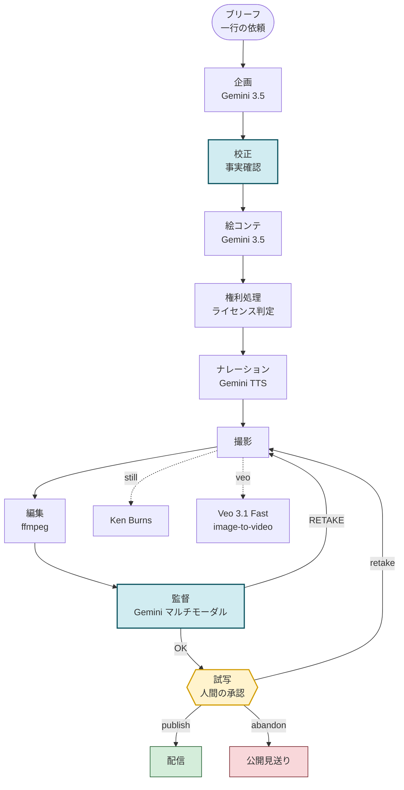

# Architecture

## The crew as a graph

## なぜこの形か

**リテイクは撮影に戻り、Join より下流に置く。** ADK のグラフで並列を組むと `JoinNode` が
全上流の出力を待つ。リテイクで撮影だけが再実行されると、走らない枝を待って**例外も出さずに
停止する**。だから並列（ナレーション生成）は循環の外、撮影の前に置いた。

**ナレーションが尺を決める。** 読速は実測で約4.5文字/秒。絵コンテの見積り（6文字/秒）で
撮ると読み切れない。先に録って実尺で撮る。

**否定する役は、違うレンズを持たせないと意味がない。** 監督は映像しか見ないので、
ナレーションが正しいかは判断できない。作品は実在の神社や滝について数値と由緒を語るため、
誤りは権利表記を落とすのと同じ種類の事故になる。校正役は原稿を素材データと突き合わせ、
**間違っていれば実害の出る主張**（数値・固有名詞・公式な指定・由緒）だけを止める。
情感の表現は止めない — そこまで止めると原稿が痩せる。

**監督は自分の指示を憶えている。** 毎回ゼロから採点する批評エージェントは収束しない
（実測で 68→62→68 と振動した）。前回の指摘と、それが反映されたかを渡すと収束する
（78→96）。

**監督の指示は必ず実行可能。** 撮影が持つレバー（カメラワーク・寄り・尺・露出・コントラスト）の
範囲でしか指示を出させない。直せない指摘はループを空回りさせる。

**承認できないまま出荷しない。** テイク上限に達しても点数に届かない場合、`accepted=false` と
監督の抗議を添えて試写に送る。人間がそれを見て決める。

**成果物は作品であって、公開先ではない。** 配信ノードはダウンロードURL・継承したライセンス・
帰属表示を必ず返す。YouTube は設定されていれば追加の公開先になる。
チャンネル未設定を `published: false` と報告していた実装は、**作品が完成しているのに失敗に見えた**。
なお試写ゲートの根拠は、取り消せない側の経路（公開）が存在することにある。

## 責務の分離

| 層 | 中身 | ADK への依存 |
|---|---|---|
| `retake/agent.py` | グラフ定義（誰がいつ動くか） | あり |
| `retake/nodes/` | クルー各員。state の読み書きと分岐 | あり |
| `retake/services/` | 生成・描画・権利判定の純粋関数 | **なし** |

`services/` が ADK を知らないため、グラフが壊れてもレンダリング・生成・権利判定を単体で
検証できる。

## 状態と失敗の扱い

- **セッション**: Cloud SQL (Postgres) に永続化する。ADK は Cloud Run 上では既定で
  セッションをメモリに置くため、再起動すると**試写で止まっているリールが消える**
  — 実行を意図的に一時停止している唯一の場所がそこなので、ここは落とせない。
  検証はリビジョンを入れ替えて state が読み戻せることで行った（`min-instances` に依存しない）。
  ADK は `create_async_engine` を使うのでドライバは非同期のもの（`asyncpg`）が要る
- **成果物**: マスターは GCS、試写用プロキシ（1/34のサイズ）だけをセッションに載せる。
  Cloud Run のファイルシステムは tmpfs で、マスターを載せるとセッションが膨らむ。
  配信は**ストリーミング**で返す。`Content-Length` を付けるとバッファ応答になり、
  Cloud Run が32MB超を拒否する（アプリは200を返しているのにフロントが500にする）
- **state のシリアライズ**: セッションは JSON で永続化され整数キーが文字列になるため、
  index 付きデータはリストで保持する
- **部分的失敗**: 1ロケの撮影失敗はそのカットを落とすだけで、撮影全体を止めない。
  ナレーション失敗は無音トラックで埋める（音声欠落は以降のカットを同期ずれさせる）
- **中間ファイル**: 差し替えられた時点で破棄する。tmpfs では溜めるとメモリを食う
- **資格情報**: APIキーは Secret Manager から注入し、リポジトリにもコマンドラインにも置かない
- **生成コスト**: Veo は素材とプロンプトのハッシュでキャッシュし、リテイクで再課金しない
